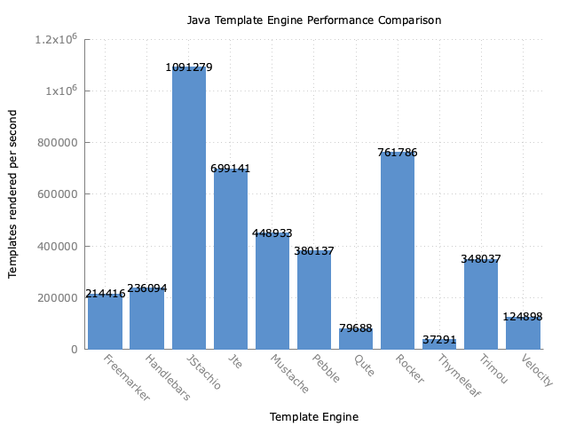

template-benchmark
================

JMH benchmark for popular Java template engines:

* [Freemarker](http://freemarker.org/)
* [JStachio](https://github.com/jstachio/jstachio)
* [jte](https://github.com/casid/jte)
* [Mustache](https://github.com/spullara/mustache.java)
* [Pebble](http://www.mitchellbosecke.com/pebble)
* [Rocker](https://github.com/fizzed/rocker)
* [Thymeleaf](http://www.thymeleaf.org/)
* [Trimou](http://trimou.org/)
* [Velocity](http://velocity.apache.org/)

UTF-8 benchmark branch
======================

The original template-engine benchmark has some flaws:

* Test data is only in latin1 when it really should have some extended UTF-8
* Only tests String output. Because the final results in the real world are UTF-8 bytes that should be the tested output.
* HTML escaping should be turned on! 
* The test was originally single threaded it is now set to 16 threads
* Various frameworks (ab)use threadlocals by default and for some it is optional

Consequently threadlocal usage has been turned off for the UTF-8 testing, pre-encoding if available turned on 
and HTML escaping turned on for tested frameworks.

The major impetus for these changes is to more closely model the real world and TechEmpowers benchmarks.

If the test data is *only in latin1* then using a `StringBuilder` (preferable one reused with threadlocals)
and then calling `String.getBytes(StandardCharsets.UTF_8)` will outperform trying to use 
pre-encoding techniques (static parts of templates are converted into bytes in advance).

Currently only JStachio, Rocker, and JTE are tested because they are the only ones that can do something special
for byte output.
I have done my best to configure them correctly for fast UTF-8 output (e.g. use pre-encoding). 
All of the tests **copy** the results of their encoded buffer to a byte array regardless 
if they have the ability to read without copying. The theory is this cost should be relatively the same
across frameworks (with the exception of String.getBytes on latin1 characters). Similarly
if all frameworks used threadlocals for pooling the results would be similar as it is fixed overhead.

The complying tests are suffixed with `Utf8`.

**Important:** The `StringGetBytes` uses JStachio (since it performed the fastest in the normal String output)  
`StringBuilder.toString().getBytes(...)` as a comparison of
leveraging pre-encoding and to show how fast it is on latin1 but how slow it is on extended characters.
However it does not use threadlocals like the original test does.

## Output Buffering Algorithms

When a template engine executes it needs an output like object. Usually this is an `OutputStream`.
In the case of high performance web applications that generate HTML the entire HTML output is usually buffered.
The reason is that `content-length` header needs to be set and is a requirement for the TechEmpower benchmarks.

* ARRAY - This is what JStachio uses and recommends. This is essentially `ByteArrayOutputStream` where an array grows.
  The pre-encoded byte arrays are copied to a single array that will grow when needed.
  It is notable in that it is the only one that can reuse allocation via threadlocal but this test does not do that.
* CHUNK - JTE and Rocker use this algorithm for UTF-8 pre-encoding. The idea is to keep a list of byte arrays.
* DEQUE - Basically CHUNK but uses a Deque instead of an ArrayList. This comes from Springs `FastByteArrayOutputStream`.

To make things fair we test all three of the algorithms (deque is currently off)
against each templating engine instead of letting the template engine choose.

## Extended UTF-8 test data :

*Only 5* non-latin1 characters were added! (a mixture of Chinese and Japanese)

`java -Dbenchmark.utf8=true -jar target/benchmarks.jar Utf8 -rff results-utf8.csv -rf csv`

## Original latin1 test data but with pre-encoding setups:

Only latin1 characters are used in test data just like original benchmark 
(actually the data is closer to ASCII as it is all below 255). 

`java  -jar target/benchmarks.jar Utf8 -rff results-ascii.csv -rf csv`

`StringBuilder.toString().getBytes(...)` is vastly superior to pre-encoding if
all the characters are latin1. This is something you can leverage if you are absolutely
certain all the characters are latin1 or even better ASCII. However a single emoji based
on the previous results will make `toString().getBytes(...)` slow.

## Original String output test

Here is the updated results using normal String no escaping, threadlocals if possible
output **but 16 threads**

**The original benchmark instructions are below**

-----------------------------------------------

Running the benchmark
======================

1. Download the source code and build it (`mvn clean install`)
2. Run the entire benchmark suite with `java -jar target/benchmarks.jar`
3. (Optional) To run a single benchmark, such as Mustache, use `java -jar target/benchmarks.jar Mustache`

Generating plot
===============
1. Run benchmark while exporting results to csv with `java -jar target/benchmarks.jar -rff results.csv -rf csv`
2. Use gnuplot to generate plot with `gnuplot benchmark.plot`. This will output `results.png`.

Rules of Template Engine Configuration
======================================
It is imperative that each template engine is configured in way to reflect real-world usage as opposed to it's *optimal* configuration. Typically this means an out-of-the-box configuration.

To strive for a common set of features across template engines, the following configurations are expected:
* Disabling of HTML escaping
* Template loaded from classpath prior to actual benchmark

Interpreting the Results
========================
The benchmarks measure throughput, given in "ops/time". The time unit used is seconds.
Generally, the score represents the number of templates rendered per second; the higher the score, the better.

Example Results
===============

