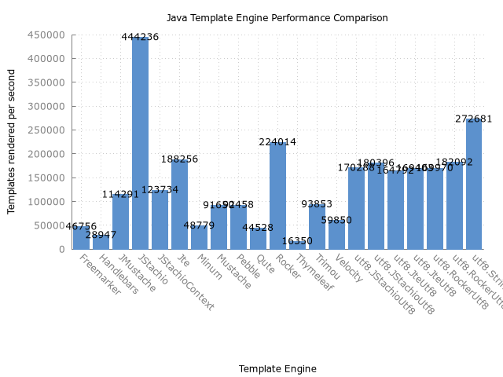

template-benchmark
================

JMH benchmark for popular Java template engines:

* [Freemarker](http://freemarker.org/)
* [JStachio](https://github.com/jstachio/jstachio)
* [jte](https://github.com/casid/jte)
* [Mustache](https://github.com/spullara/mustache.java)
* [Pebble](http://www.mitchellbosecke.com/pebble)
* [Rocker](https://github.com/fizzed/rocker)
* [Thymeleaf](http://www.thymeleaf.org/)
* [Trimou](http://trimou.org/)
* [Velocity](http://velocity.apache.org/)

UTF-8 benchmark branch
======================

The original template-engine benchmark has some flaws:

* Test data is only in latin1 UTF-8
* Because of the above the output should be byte based and not string
* HTML escaping is not turned on
* The test was originally single threaded it is now set to 16 threads
* Various frameworks (ab)use threadlocals by default and some it is optional

Consequently threadlocal usage has been turned off, pre-encoding if available turned on 
and HTML escaping turned on for tested frameworks.

The major impetus for these changes is to more closely model real world and TechEmpowers benchmarks.

If the test data is only in latin1 then using a `StringBuilder` (preferable one reused with threadlocals)
and then calling `String.getBytes(StandardCharsets.UTF_8)` will outperform trying to use 
pre-encoding techniques (static parts of templates are converted into bytes in advance).

Currently only JStachio, Rocker, and JTE are tested. I have done my best to configure them
correctly. All of the tests **copy** the results of their encoded buffer to byte array regardless 
if they have the ability to read without copying. The theory is this cost should be relatively the same
across frameworks (with the exception of String.getBytes on ascii characters).

The complying tests are suffixed with Utf8.

The JStachioStringUtf8 uses `StringBuilder.toString().getBytes(...)` as a comparison of
leveraging pre-encoding and to show how fast it is on latin1 characters.

Add non ascii test data (only 4 non ascii characters were added to the test data!):

`java -Dbenchmark.utf8=true -jar target/benchmarks.jar Utf8 -rff results-utf8.csv -rf csv`

Use original ascii test data but with pre-encoding setups:

`java  -jar target/benchmarks.jar Utf8 -rff results-ascii.csv -rf csv`

**The original benchmark instructions are below**

Running the benchmark
======================

1. Download the source code and build it (`mvn clean install`)
2. Run the entire benchmark suite with `java -jar target/benchmarks.jar`
3. (Optional) To run a single benchmark, such as Mustache, use `java -jar target/benchmarks.jar Mustache`

Generating plot
===============
1. Run benchmark while exporting results to csv with `java -jar target/benchmarks.jar -rff results.csv -rf csv`
2. Use gnuplot to generate plot with `gnuplot benchmark.plot`. This will output `results.png`.

Rules of Template Engine Configuration
======================================
It is imperative that each template engine is configured in way to reflect real-world usage as opposed to it's *optimal* configuration. Typically this means an out-of-the-box configuration.

To strive for a common set of features across template engines, the following configurations are expected:
* Disabling of HTML escaping
* Template loaded from classpath prior to actual benchmark

Interpreting the Results
========================
The benchmarks measure throughput, given in "ops/time". The time unit used is seconds.
Generally, the score represents the number of templates rendered per second; the higher the score, the better.

Example Results
===============

